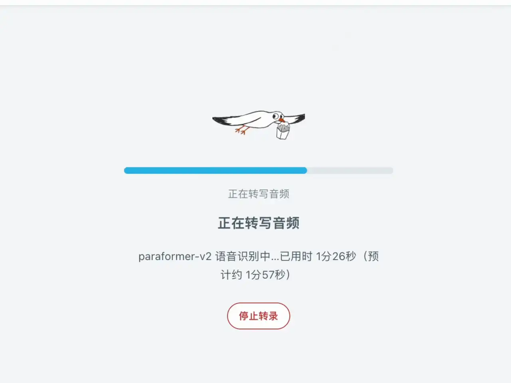
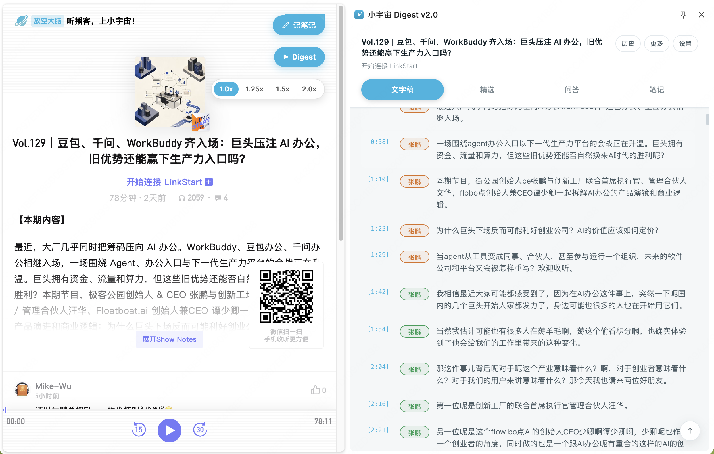
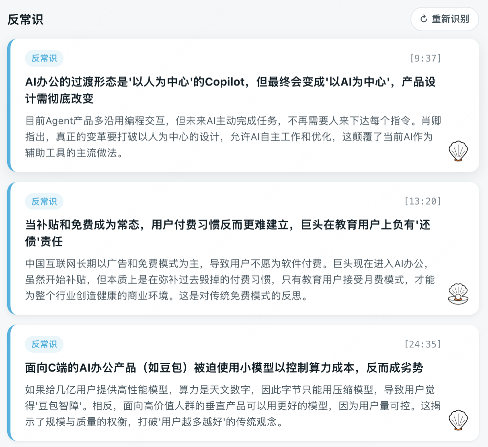
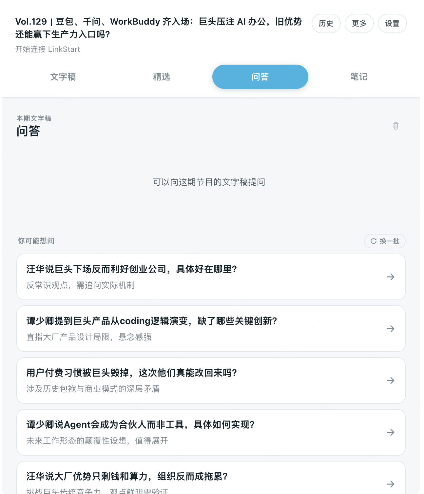
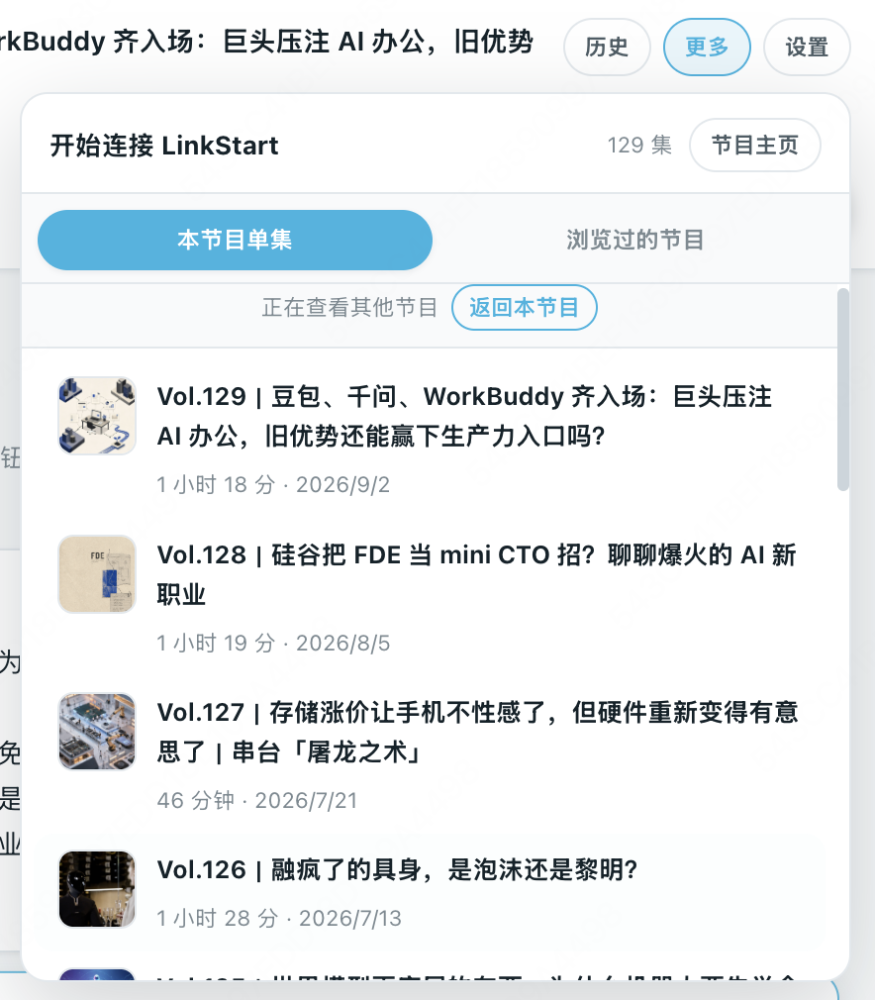

# 小宇宙 Digest

[English](README.md) | [简体中文](README.zh-CN.md)

Turn every Xiaoyuzhou podcast episode into a resource for deep reading.

小宇宙 Digest is a Chrome side panel extension. It transcribes episode audio into a timestamped transcript with Alibaba Cloud DashScope, generates AI summaries, and supports Q&A-style deep reading. Everything carries clickable timestamps, so you can jump back to the audio and learn while listening.

## Demo

## Features

### 🎙️ Speech-to-text with speaker labels

Automatically transcribe any public episode into a searchable, timestamped transcript. AI detects whether it's a conversation and how many speakers there are, labeling each speaker by name. Click any subtitle line to jump to that point in the audio.

### ✨ AI highlights, listen to what matters

Get the essence of a long episode at a glance. Favorite highlight cards, then click any card to jump straight to that part of the audio for a focused listen.

### 💬 Q&A-style deep reading

Ask questions tailored to your interests, guided by suggested prompts, for a targeted deep dive — perfect when you have a clear goal and want to truly understand an episode.

### 📚 Episode discovery & listening library

Discover more episodes from the same podcast via a link, and keep a record of episodes you care about. No need to open the mobile app or follow links — enter your favorite podcasts right from the extension.

## Getting started

### Install manually

1. Open `chrome://extensions` in Chrome.
2. Turn on **Developer mode**.
3. Click **Load unpacked** and select this project folder (it must contain `manifest.json`).
4. Pin 小宇宙 Digest from Chrome's Extensions menu.

### Set up your API keys

小宇宙 Digest runs locally with your own API keys — no developer-operated server involved:

- **DashScope API key**: for speech-to-text, created at the [Alibaba Cloud Model Studio console](https://bailian.console.aliyun.com/?apiKey=1) (paraformer-v2 / fun-asr).
- **DeepSeek API key**: for AI summaries, explanations, and note polishing, created at the [DeepSeek Platform](https://platform.deepseek.com/api_keys).

Enter both keys on the extension's Settings page; they are stored in Chrome's local storage on your device.

### Start using it

1. Open a Xiaoyuzhou episode page (`www.xiaoyuzhoufm.com/episode/...`).
2. Click the extension icon (or the floating **Digest** button) to open the side panel.
3. Once transcription finishes, read the transcript, browse AI highlights, and start a Q&A deep dive.

## Privacy

There is no account system, advertising, analytics, or telemetry. The audio URL is sent directly to Alibaba Cloud DashScope for transcription, and AI features are handled by DeepSeek. API keys, notes, and caches stay in your local Chrome storage. See [PRIVACY.md](PRIVACY.md) for details.

## License

MIT. See [LICENSE](LICENSE).
